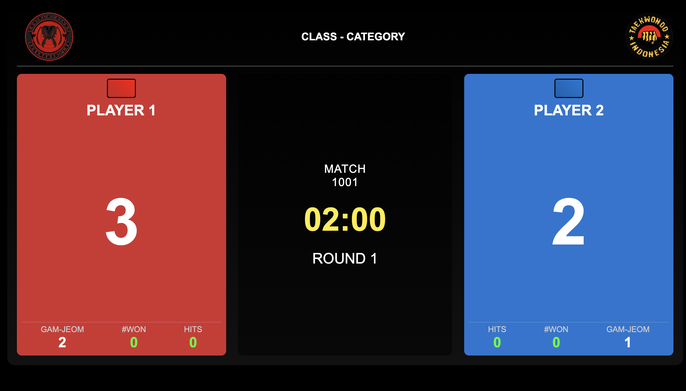
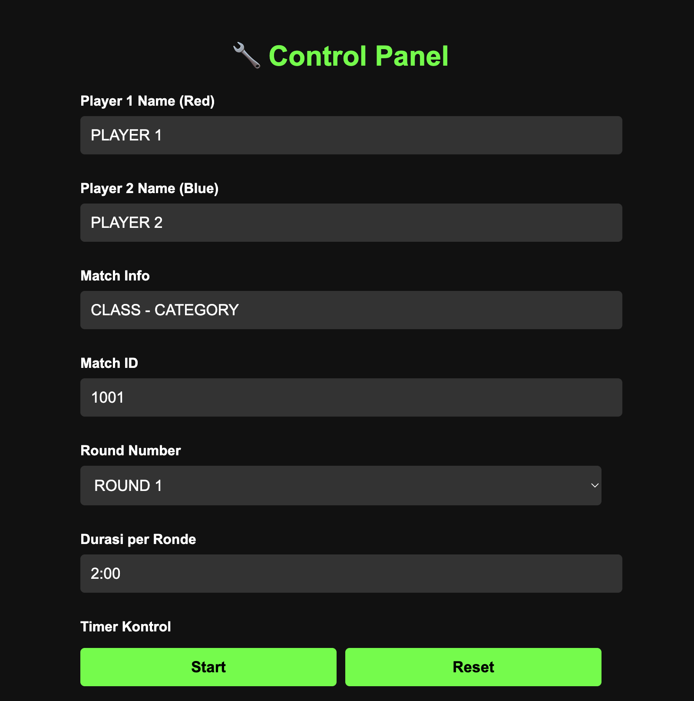
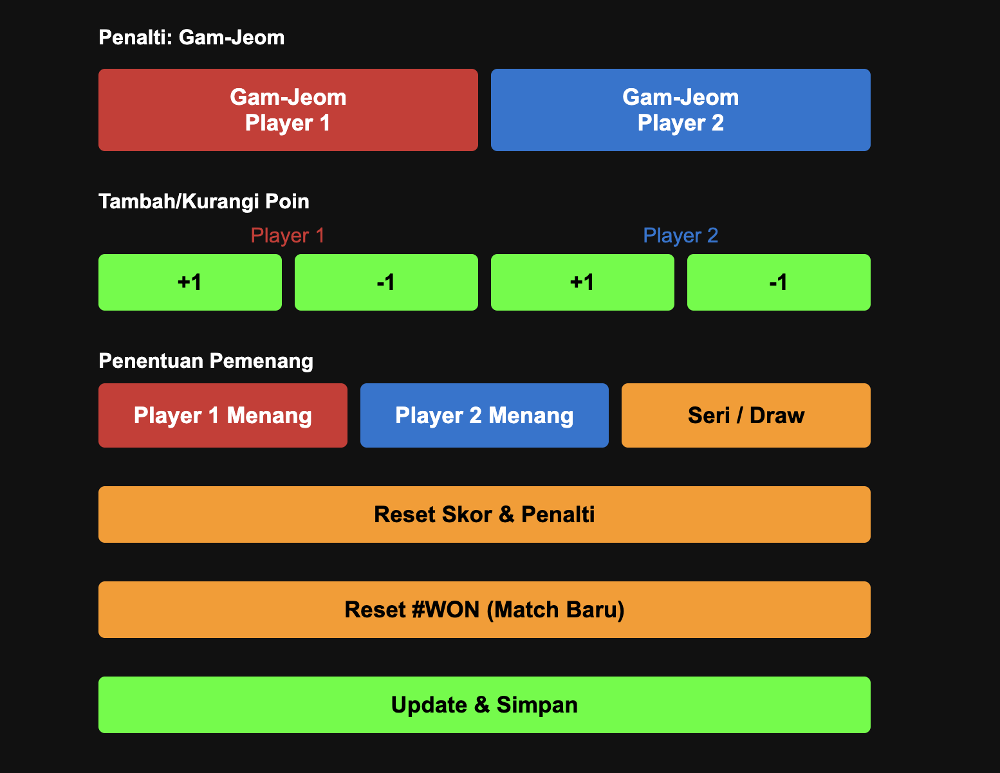
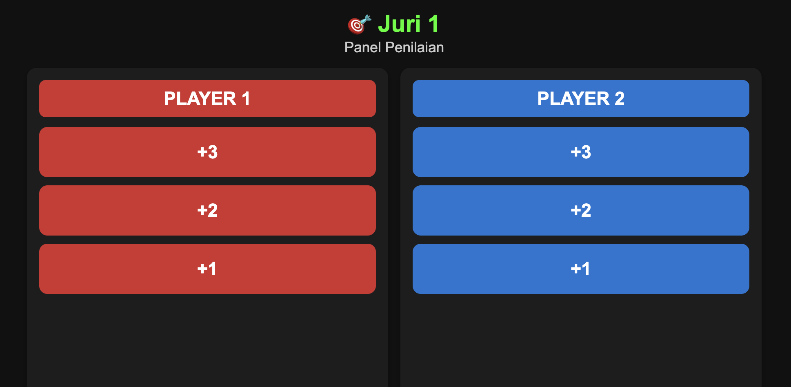

# 🥋 Taekwondo Digital Scoring System (DSS)

Sistem digital untuk penilaian pertandingan Taekwondo yang menggunakan sistem konsensus juri dan menampilkan skor secara real-time.

## 📋 Fitur Utama

### 🏆 Sistem Penilaian
- **Konsensus Juri**: Minimal 2 dari 3 juri harus setuju dalam 5 detik untuk menghitung skor
- **Tracking HITS**: Mencatat jumlah kali juri menekan tombol penilaian (nilai 1, 2, atau 3)
- **Kemenangan Otomatis**: Jika selisih skor ≥12 poin
- **Skor Akumulatif**: Dari konsensus juri sepanjang pertandingan

### ⏱️ Manajemen Waktu
- Timer hitung mundur dengan fungsi Start/Pause/Reset
- Pengaturan durasi round yang fleksibel

### ⚖️ Sistem Penalti
- **Gam-Jeom**: Maksimal 5 penalti sebelum diskualifikasi
- **#WON**: Penentuan pemenang otomatis

### 🎛️ Kontrol Manual
- Penentuan pemenang manual melalui control panel
- Pengaturan nama pemain dan informasi pertandingan

## 🖥️ Interface

### Display Board
Panel utama yang menampilkan skor dan informasi pertandingan secara real-time.



### Control Panel
Panel kontrol untuk mengatur pertandingan, timer, dan penentuan pemenang.




### Judge Panel
Interface untuk masing-masing juri (1, 2, dan 3) untuk memberikan penilaian.



## 🚀 Cara Menjalankan

### Prerequisites
- Node.js (v18 atau lebih baru)
- npm

### Instalasi
```bash
# Clone repository
git clone https://github.com/23Pstars/taekwondo-dss.git
cd taekwondo-dss

# Install dependencies
npm install

# Jalankan server
npm start
```

### Akses Interface
Setelah server berjalan, buka browser dan akses:

- **Display Board**: `http://localhost:3000/display.html`
- **Control Panel**: `http://localhost:3000/control.html`
- **Judge 1**: `http://localhost:3000/judge1.html`
- **Judge 2**: `http://localhost:3000/judge2.html`
- **Judge 3**: `http://localhost:3000/judge3.html`

## 🏗️ Teknologi yang Digunakan

- **Backend**: Node.js dengan Express.js
- **Real-time Communication**: Socket.IO
- **Frontend**: HTML5, CSS3, JavaScript
- **Responsive Design**: Mobile-friendly interface

## 📱 Responsive Design

Sistem ini dirancang untuk bekerja di berbagai perangkat:
- Desktop/Laptop untuk display board
- Tablet/Mobile untuk judge panel
- Multi-device setup untuk pertandingan resmi

## ⚙️ Konfigurasi

### Pengaturan Default
- Durasi round: 120 detik
- Maksimal Gam-Jeom: 5
- Batas selisih kemenangan otomatis: 12 poin
- Waktu konsensus juri: 5 detik